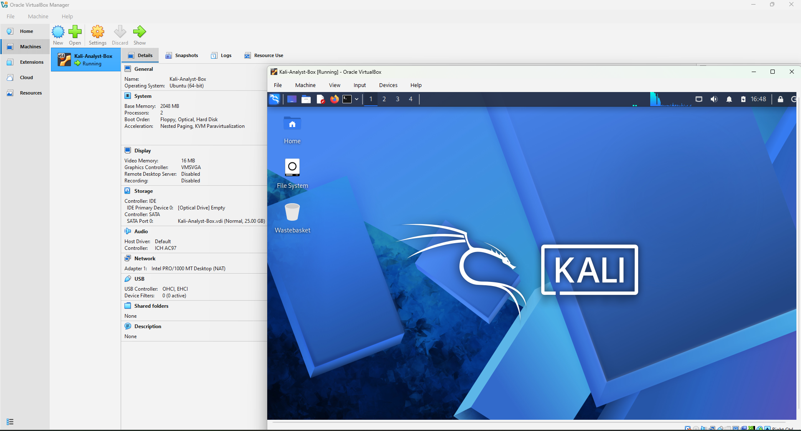

# Building an Isolated Security Research Lab: A Guided Deployment of Kali Linux on VirtualBox
## Environment & Technical Specifications 
* __Hypervisor:__ Oracle VM VirtualBox
* __Guest Operating System:__ Kali Linux (Xfe Architecture)
* __Hardware Allocation:__
* __vCPU:__ 2 Cores (Balancing performance without starving the host OS)
* __Virtual RAM:__ 2-4 GB
* __Storage:__ 25 GB Virtual Hard Disk

## Why are virtual machines so important?
In cybersecurity, safety and containment are vital. Running security tools, executing network scans, or analysing malware directly on a host operating system introduces harmful risks. To solve this, I deployed a fully isolated virtual research lab using Oracle VM VirtualBox and Kali Linux, establishing a secure 'sandbox' for legal security testing and hands-on project development.

## Key Technical Challenges 
* __Host vs. Guest Isolation:__ To achieve host-guest isolation, Oracle VM VirtualBox functions as a Type-2 Hypervisor. It abstracts my laptop's physical hardware, presenting a fully virtualized environment (vCPU, vRAM, and a vDisk) to the Guest OS. Because the entire Kali file system is structurally wrapped within a single .vdi virtual disk file on the host system the guest operating system remains entirely sandboxed, unable to access, view, or alter my personal host files or underlying architecture.
* __Storage Partitioning:__ During the disk configuration phase, I opted for Guided Partitioning (All files in one partition). This automated the complex process of formatting the system files (ext4) and calculating directory paths. structuring the 25 GB virtual space for optimal stability.
* __The GRUB Boot Loader:__  I successfully installed the GRUB boot loader directly to the primary virtual drive, ensuring the virtual machine can independently initiate the boot sequence upon startup.

## Verification
* Check that the system actually functions as intended.
* __Network Connectivity Test__: To verify that the VM is working correctly, I opened the Linux Terminal and executed a packet internet groper command:
  ```bash
  ping -c 3 google.com


## Future Plans
With the baseline infrastructure established, this lab will serve as the foundation for my upcoming portfolio projects, including:
* Packet analysis and traffic sniffing via Wireshark.
* Deploying an isolated target machine to practice vulnerability exploitation safely.
